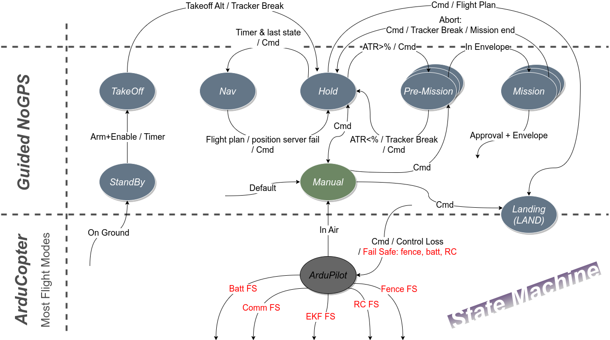
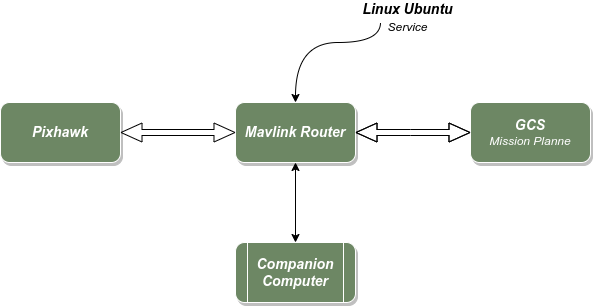
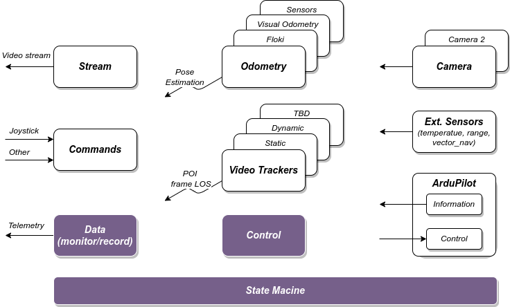
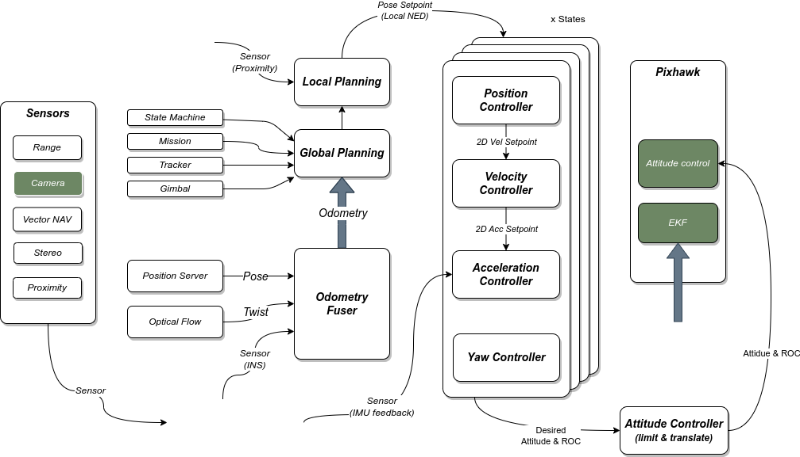
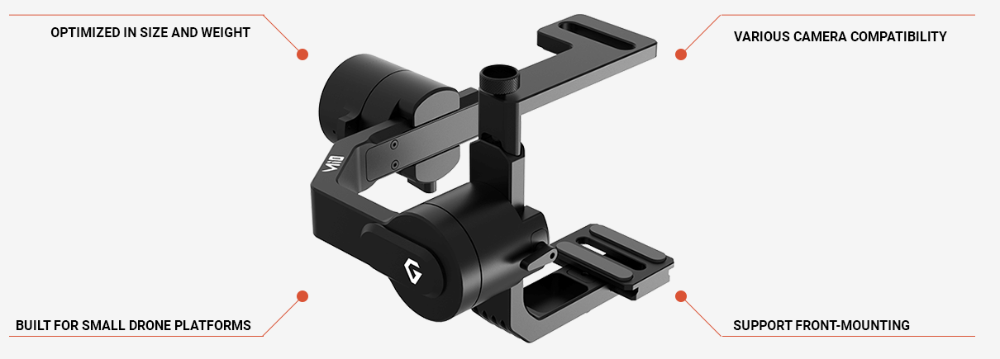
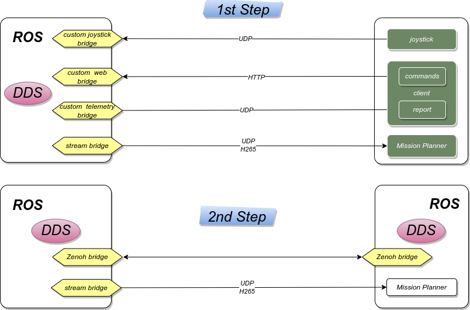

# Agenda
- Current System Design
  - State Machine
  - Mavlink Routing
- **'Rome'** System Architecture
  - General Design
  - Control Design

---
# Agenda
- Main Design Principles
  - Setup Definition
  - ROS
    - Verbs: Nodes, Messages, Parameters
    - Echo System
    - DDS
  - Development Standard

---
# Agenda
- Migration Process
  - Home <--> Field
  - Work Method
  - On going migration

---
### State Machine

---
### Mavlink Routing

---
### General Design

---
### Control Design

---
### Design Zen
- Ros is only a way of implementation
  - Bridge can always be used as a legitimate solution
- "Don't invent the wheel..."
- Design must consider **Testability**
- System resources are limited
  - network, cpu, memory
  
---
### Setup Definition
##### Hardware
- RomBox-III new architecture
  - Includes Jetson Orin
- [Gimbal: Gremsy two-axis-mio](https://gremsy.com/gremsy-introduces-two-axis-mio-gimbal-for-drone-developers)
- New Sensors:
  - temp, range, proximity, stereo (point cloud)
  

---
### Setup Definition
##### Software
- Ubuntu LTS latest (22.04)
- ROS LTS latest (Humble)
- DDS Vendor (fast rtps / cyclonDDS)

---
### ROS Verbs
- Nodes
- Topics and Messages
- Pub/Sub
- Service: RPC
- Action: long time service
- Parameters: config node behavior

---
### Nodes
- Units of work
- Example:
  - camera capture
  - camera control
  - tracker
  - streaming
  - gpio control

---
### Messages
- Units of data
  - Do not mix data from different domains
- As many as needed
- Try to use standard msgs

---
### Topic
- Namespace
- Meaningful names
- Try to use common name from community
- Example:
  - boson/camera, boson/camera_info
  - next_vision/camera, next_vision/camera_info
  
---
### ROS echo
- Process monitoring
- Diagnostics standard
- Logging 
- Records (ROS bag)
- dev Tools
  - rqt
  - rviz
  - gazebo
  - PlotJuggler

---
### DDS
- DDS exists within LAN only
  - Use bridges to cross between LANs (ZENOH)
- Consider DDS Discovery
- Use SHM if possible (Shared Memory)

---
### Development Standard
-  code 
   -  python / cpp
-  tests
-  packaging
   -  deb (with dependencies)
   -  docker
-  documentation
   -  Code general description
   -  Interface
   -  Install & Usage

---
### Resource & Performance
- Use zero copy / loan for big messages
- System test case

---
### Migration Process
      Field <----------------------------------> Home

---
### Work Method
- Describe each cube from "General Design" in ROS orientation
- Design each node
- Implementation
- Tests
- Integration

---
### On going migration
- Partial test, on exist system
- RomBox-III, Run as a Payload